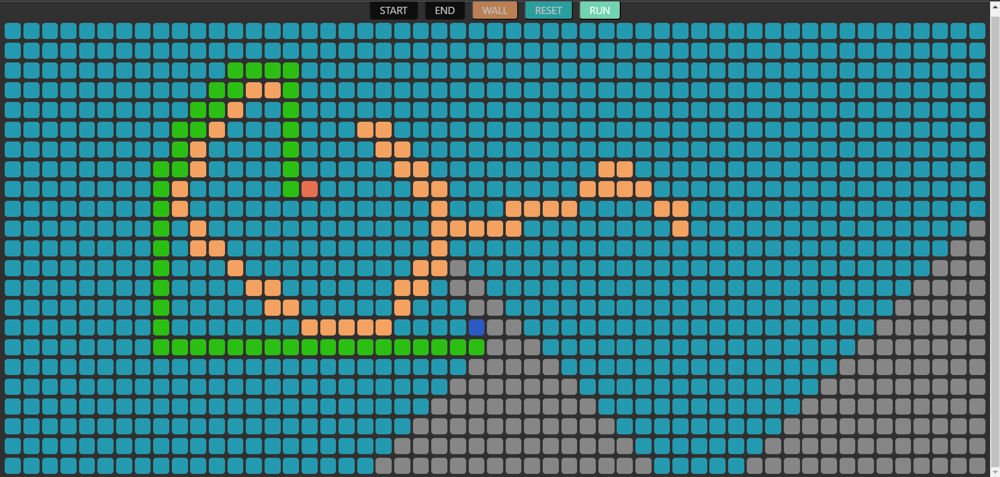

# Dijkstra's Visualizer React

This web application is a visualization tool for the Dijkstra's algorithm, a popular algorithm in graph theory used to find the shortest path between two nodes in a graph. The application is built using React and it is deployed at [https://huhu72.github.io/Dijkstra-s-visualizer-react/](https://huhu72.github.io/Dijkstra-s-visualizer-react/).

## Usage

To use the application, follow these steps:

1. Click the "Start" button to enable node selection mode
2. Click any square to set it as the starting node
3. Click the "End" button to enable end node selection mode
4. Click any square to set it as the ending node
5. Click the "Wall" button to enable wall node selection mode
6. Click any square to set it as a wall node
7. Click the "Run" button to run the algorithm and visualize the shortest path between the start and end nodes
8. To reset the grid, click the "Reset" button.

## Demo

Here's a screenshot of the application in action:

## Contributing

Contributions to the project are always welcome! If you find a bug or have an idea for a new feature, please open an issue on the [GitHub repository](https://github.com/huhu72/Dijkstra-s-visualizer-react/issues) or submit a pull request.

## License

This project is licensed under the [MIT license](./LICENSE).
